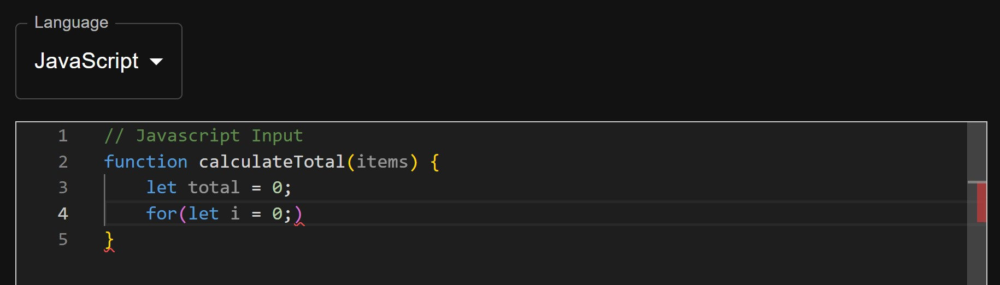
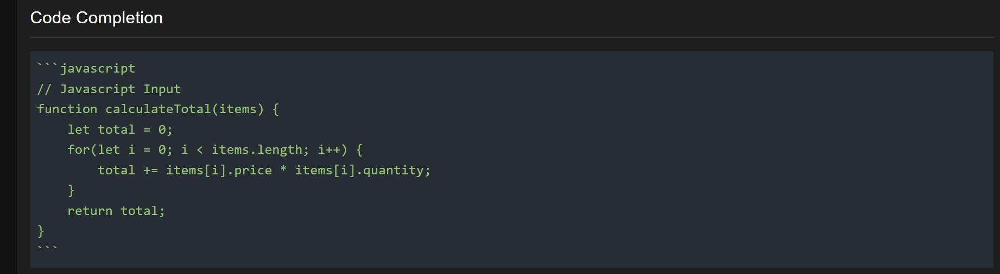
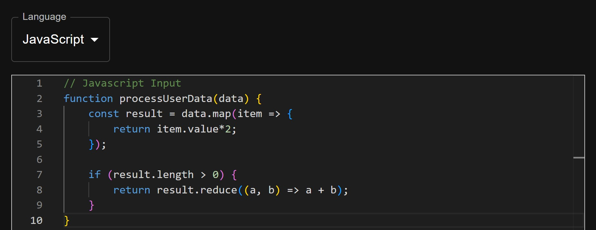
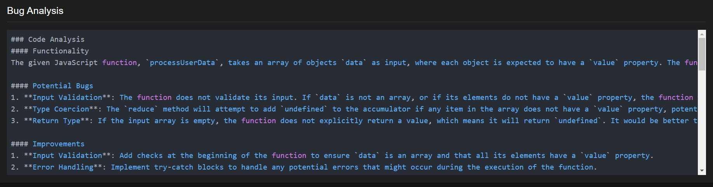
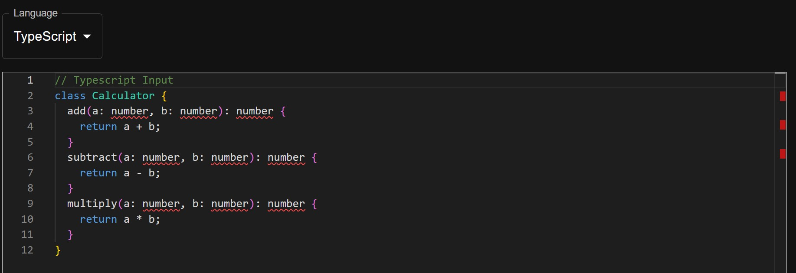
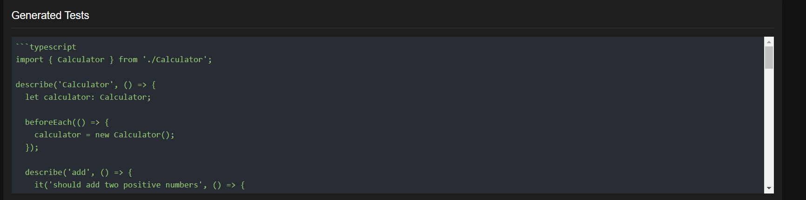
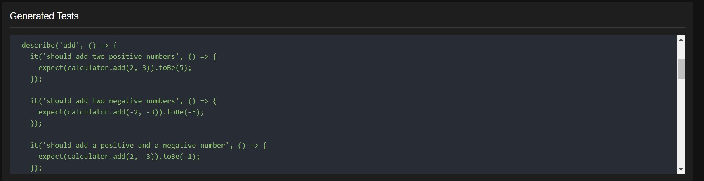
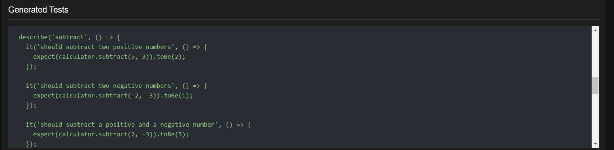
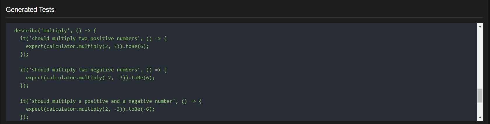

# Intelligent IDE

An intelligent code assistant powered by Groq's LLM (Llama-3.3-70b) that helps developers with code completion, bug analysis, and test case generation.

## 🚀 Features

### 1. Code Completion

- Code suggestions
- Context-aware completions
- Support for multiple programming languages
- Intelligent code pattern recognition

### 2. Bug Analysis

- Static code analysis
- Potential bug detection
- Code quality suggestions
- Best practices recommendations
- Security vulnerability checks

### 3. Test Generation

- Automated unit test generation
- Test case suggestions
- Coverage optimization
- Testing best practices

## 🛠️ Technology Stack

### Frontend

- **React**: UI framework
- **TypeScript**: Type safety and better developer experience
- **Material-UI**: Component library for modern design
- **Monaco Editor**: Code editor component (same as VS Code)
- **Axios**: HTTP client for API requests

### Backend

- **Node.js**: Runtime environment
- **Express**: Web framework
- **TypeScript**: Type safety
- **Groq API**: LLM integration using Llama-3.3-70b model

## 🏗️ Architecture

```plaintext
├── frontend/
│ ├── src/
│ │ ├── components/
│ │ │ ├── Editor/
│ │ │ ├── CodeAnalysis/
│ │ │ └── Layout/
│ │ ├── services/
│ │ └── utils/
│ └── public/
└── backend/
├── src/
│ ├── controllers/
│ ├── services/
│ └── routes/
└── config/
```
## Supported Programming Languages

- JavaScript
- TypeScript
- Python
- Java
- C++

## 🚀 Getting Started

### Prerequisites

- Node.js (v14 or higher)
- npm or yarn
- Groq API key

### Installation

1. Clone the repository:

```bash
    git clone https://github.com/brain05girl/Intelligent-IDE
    cd intelligent-ide
```

2. Install backend dependencies:

```bash
    cd backend
    npm install
```

3. Configure environment variables:
   Create .env file in backend directory

```bash
    PORT=3001
    GROQ_API_KEY=your-groq-api-key
```

> **⚠️ Important Notes about Groq API:**
>
> 1. **API Key**:
>
>    - Sign up for a free Groq account at https://console.groq.com
>    - Get your API key from the Groq console
>    - Replace `your-groq-api-key` with your actual Groq API key
>
> 2. **Usage Limits**:
>
>    - Groq offers a free tier with limited API calls
>    - Monitor your usage in the Groq console
>    - If you exceed the free limit, the API will return errors
>    - Consider implementing rate limiting in your application
>
> 3. **Troubleshooting**:
>
>    - If you're not getting responses, check your API usage in Groq console
>    - Error 429: You've exceeded the rate limit
>    - Error 401: Invalid API key
>    - Error 503: Service temporarily unavailable
>
> 4. **Best Practices**:
>    - Don't commit your API key to version control
>    - Implement caching to reduce API calls
>    - Add error handling for rate limit cases
>    - Consider implementing a fallback service

### Rate Limits and Quotas

- Free tier includes limited API calls per month
- Monitor your usage regularly
- Implement caching when possible
- Consider upgrading for production use

4. Install frontend dependencies:

```bash
    cd ../frontend
    npm install
```

5. Start the application:

Terminal 1 - Backend

```bash
    cd backend
    npm run dev
```

Terminal 2 - Frontend

```bash
    cd frontend
    npm start
```

## 🎯 Usage Examples

### Code Completion

```javascript
// Javascript Input
function calculateTotal(items) {
    let total = 0;
    for(let i = 0;


// AI will complete the code
function calculateTotal(items)
{
    let total = 0;
    for(let i = 0; i < items.length; i++) {
        total += items[i].price;
    }
    return total;
}
```
Input:  


Output:
 

### Bug Analysis

```javascript

// Javascript Input
function processUserData(data) {
    const result = data.map(item => {
        return item.value*2;
    });

    if (result.length > 0) {
        return result.reduce((a, b) => a + b);
    }
}


// AI will analyze and suggest:
1. Missing null/undefined check for 'data'
2. No error handling for invalid item.value
3. No return statement for empty array case
```

Input:  


Output:
 

### Test Generation Example

```typescript
// Typescript Input
class Calculator {
  add(a: number, b: number): number {
    return a + b;
  }
  subtract(a: number, b: number): number {
    return a - b;
  }
  multiply(a: number, b: number): number {
    return a * b;
  }
}

// AI Generated Tests
import { describe, expect, test } from "jest";

describe("Calculator", () => {
  let calculator: Calculator;

  beforeEach(() => {
    calculator = new Calculator();
  });

  describe("add", () => {
    test("should add two positive numbers correctly", () => {
      expect(calculator.add(2, 3)).toBe(5);
    });

    test("should handle negative numbers", () => {
      expect(calculator.add(-1, -2)).toBe(-3);
    });

    test("should handle zero", () => {
      expect(calculator.add(0, 5)).toBe(5);
      expect(calculator.add(5, 0)).toBe(5);
    });
  });

  describe("subtract", () => {
    test("should subtract two positive numbers correctly", () => {
      expect(calculator.subtract(5, 3)).toBe(2);
    });

    test("should handle negative numbers", () => {
      expect(calculator.subtract(-1, -2)).toBe(1);
    });

    test("should handle zero", () => {
      expect(calculator.subtract(5, 0)).toBe(5);
    });
  });

  describe("multiply", () => {
    test("should multiply two positive numbers correctly", () => {
      expect(calculator.multiply(2, 3)).toBe(6);
    });

    test("should handle negative numbers", () => {
      expect(calculator.multiply(-2, 3)).toBe(-6);
      expect(calculator.multiply(-2, -3)).toBe(6);
    });

    test("should handle zero", () => {
      expect(calculator.multiply(5, 0)).toBe(0);
      expect(calculator.multiply(0, 5)).toBe(0);
    });
  });
});
```

Input:  


Output:
 
 
 
 

## 🔄 Workflow

1. **Code Input**: User enters code in the Monaco editor
2. **Language Selection**: User selects the programming language
3. **Feature Selection**: User chooses between:
   - Code completion
   - Bug analysis
   - Test generation
4. **Processing**: Backend sends request to Groq API
5. **Result Display**: Results are displayed in a formatted view

## 🛡️ Error Handling

- Frontend validation for code input
- Backend request validation
- Groq API error handling
- User-friendly error messages
- Request timeout handling

## 🔒 Security

- Environment variable protection
- API key security
- Input validation
- Rate limiting
- CORS configuration

## 🔍 Testing

### Frontend Tests

```bash
    cd frontend
    npm test
```

### Backend Tests

```bash
    cd backend
    npm test
```

## 🤝 Contributing

1. Fork the repository
2. Create your feature branch (`git checkout -b feature/AmazingFeature`)
3. Commit your changes (`git commit -m 'Add some AmazingFeature'`)
4. Push to the branch (`git push origin feature/AmazingFeature`)
5. Open a Pull Request

## 📝 License

This project is licensed under the MIT License - see the [LICENSE](LICENSE) file for details.

## 🙏 Acknowledgments

- Groq for providing the LLM API
- Monaco Editor team
- Material-UI team
- Open source community

## 📞 Support

For support, write to us at email - mishtyg70@gmail.com
